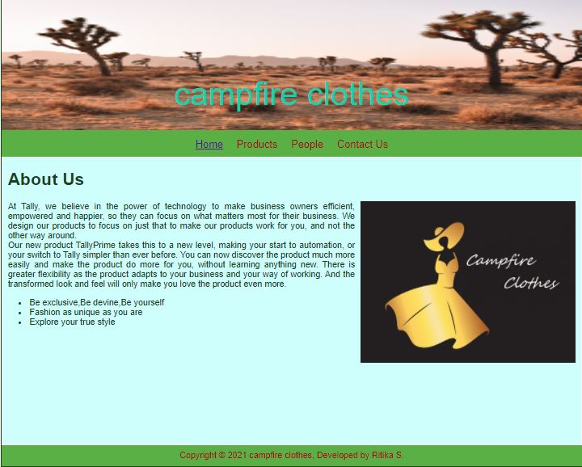
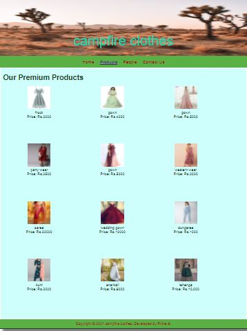
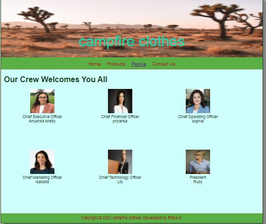
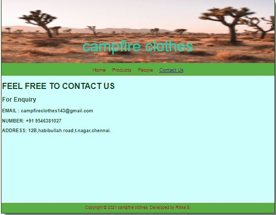

# Web Design for a Software Product Company

## AIM:

To design a static website for a software product company company.

## DESIGN STEPS:

### Step 1:

Requirement collection.

### Step 2:

Creating the layout using HTML and CSS.

### Step 3:

Updating the sample content.

### Step 4:

Choose the appropriate style and color scheme.

### Step 5:

Validate the layout in various browsers.

### Step 6:

Validate the HTML code.

### Step 6:

Publish the website in the given URL.

## PROGRAM :
### Home :
~~~
<!DOCTYPE html>
<html lang="en">
  <head>
    <title>campfire clothes</title>
    <link rel="stylesheet" href="./css/layout.css" />
    <link rel="icon" href="./img/icon.png" type="image/x-icon" />
  </head>

  <body>
    

      
campfire clothes

      

        
<a href="/static/home.html">Home</a>

        
<a href="/static/products.html">Products</a>

        
<a href="/static/people.html">People</a>

        
<a href="/static/contact us.html">Contact Us</a>

      

      

        

          <h1>About Us</h1>
          
          

            At Tally, we believe in the power of technology to make business
            owners efficient, empowered and happier, so they can focus on what
            matters most for their business. We design our products to focus on
            just that to make our products work for you, and not the other way
            around.
             
            Our new product TallyPrime takes this to a new level, making your
            start to automation, or your switch to Tally simpler than ever
            before. You can now discover the product much more easily and make
            the product do more for you, without learning anything new. There is
            greater flexibility as the product adapts to your business and your
            way of working. And the transformed look and feel will only make you
            love the product even more.
            <ul>
              <li>Be exclusive,Be devine,Be yourself</li>
              <li>Fashion as unique as you are</li>
              <li>Explore your true style</li>
            </ul>
          

        

      

      

        Copyright &#169; 2021 campfire clothes, Developed by Ritika S.
      

    

  </body>
</html>
~~~

### product :
~~~
<!DOCTYPE html>
<html lang="en">
  <head>
    <title>campfire clothes</title>
    <link rel="stylesheet" href="./css/layout.css" />
    <link rel="icon" href="./img/icon.png" type="image/x-icon" />
  </head>

  <body>
    

      
campfire clothes

      

        
<a href="/static/home.html">Home</a>

        
<a href="/static/products.html">Products</a>

        
<a href="/static/people.html">People</a>

        
<a href="/static/contact us.html">Contact Us</a>

      

      

        

          <h1>About Us</h1>
          
          

            At Tally, we believe in the power of technology to make business
            owners efficient, empowered and happier, so they can focus on what
            matters most for their business. We design our products to focus on
            just that to make our products work for you, and not the other way
            around.
             
            Our new product TallyPrime takes this to a new level, making your
            start to automation, or your switch to Tally simpler than ever
            before. You can now discover the product much more easily and make
            the product do more for you, without learning anything new. There is
            greater flexibility as the product adapts to your business and your
            way of working. And the transformed look and feel will only make you
            love the product even more.
            <ul>
              <li>Be exclusive,Be devine,Be yourself</li>
              <li>Fashion as unique as you are</li>
              <li>Explore your true style</li>
            </ul>
          

        

      

      

        Copyright &#169; 2021 campfire clothes, Developed by Ritika S.
      

    

  </body>
</html>
~~~

### people :
~~~
<!DOCTYPE html>
<html lang="en">
  <head>
    <title>campfire clothes</title>
    <link rel="stylesheet" href="./css/layout.css" />
    <link rel="icon" href="./img/icon.png" type="image/x-icon" />
  </head>

  <body>
    

      
campfire clothes

      

        
<a href="/static/home.html">Home</a>

        
<a href="/static/products.html">Products</a>

        
<a href="/static/people.html">People</a>

        
<a href="/static/contact us.html">Contact Us</a>

      

      

        

          <h1>About Us</h1>
          
          

            At Tally, we believe in the power of technology to make business
            owners efficient, empowered and happier, so they can focus on what
            matters most for their business. We design our products to focus on
            just that to make our products work for you, and not the other way
            around.
             
            Our new product TallyPrime takes this to a new level, making your
            start to automation, or your switch to Tally simpler than ever
            before. You can now discover the product much more easily and make
            the product do more for you, without learning anything new. There is
            greater flexibility as the product adapts to your business and your
            way of working. And the transformed look and feel will only make you
            love the product even more.
            <ul>
              <li>Be exclusive,Be devine,Be yourself</li>
              <li>Fashion as unique as you are</li>
              <li>Explore your true style</li>
            </ul>
          

        

      

      

        Copyright &#169; 2021 campfire clothes, Developed by Ritika S.
      

    

  </body>
</html>
~~~

### contact :
~~~
<!DOCTYPE html>
<html lang="en">
  <head>
    <title>campfire clothes</title>
    <link rel="stylesheet" href="./css/layout.css" />
    <link rel="icon" href="./img/icon.png" type="image/x-icon" />
  </head>

  <body>
    

      
campfire clothes

      

        
<a href="/static/home.html">Home</a>

        
<a href="/static/products.html">Products</a>

        
<a href="/static/people.html">People</a>

        
<a href="/static/contact us.html">Contact Us</a>

      

      

        

          <h1>About Us</h1>
          
          

            At Tally, we believe in the power of technology to make business
            owners efficient, empowered and happier, so they can focus on what
            matters most for their business. We design our products to focus on
            just that to make our products work for you, and not the other way
            around.
             
            Our new product TallyPrime takes this to a new level, making your
            start to automation, or your switch to Tally simpler than ever
            before. You can now discover the product much more easily and make
            the product do more for you, without learning anything new. There is
            greater flexibility as the product adapts to your business and your
            way of working. And the transformed look and feel will only make you
            love the product even more.
            <ul>
              <li>Be exclusive,Be devine,Be yourself</li>
              <li>Fashion as unique as you are</li>
              <li>Explore your true style</li>
            </ul>
          

        

      

      

        Copyright &#169; 2021 campfire clothes, Developed by Ritika S.
      

    

  </body>
</html>
~~~

## OUTPUT:

### Home Page:

### Products page:

### People page:

### contact page:

## Result:

Thus a website is designed for the software product company and the HTML,CSS code are validated.
